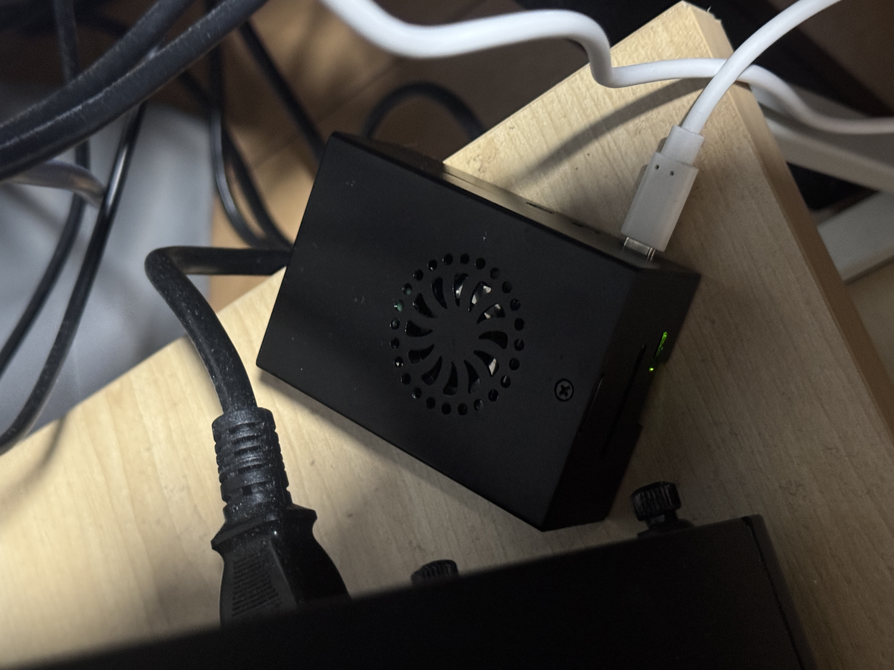
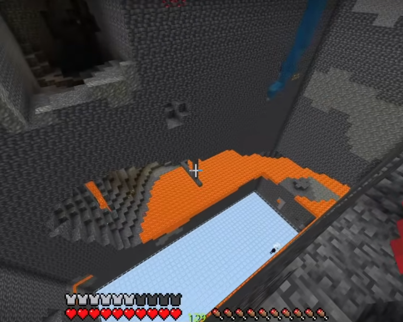
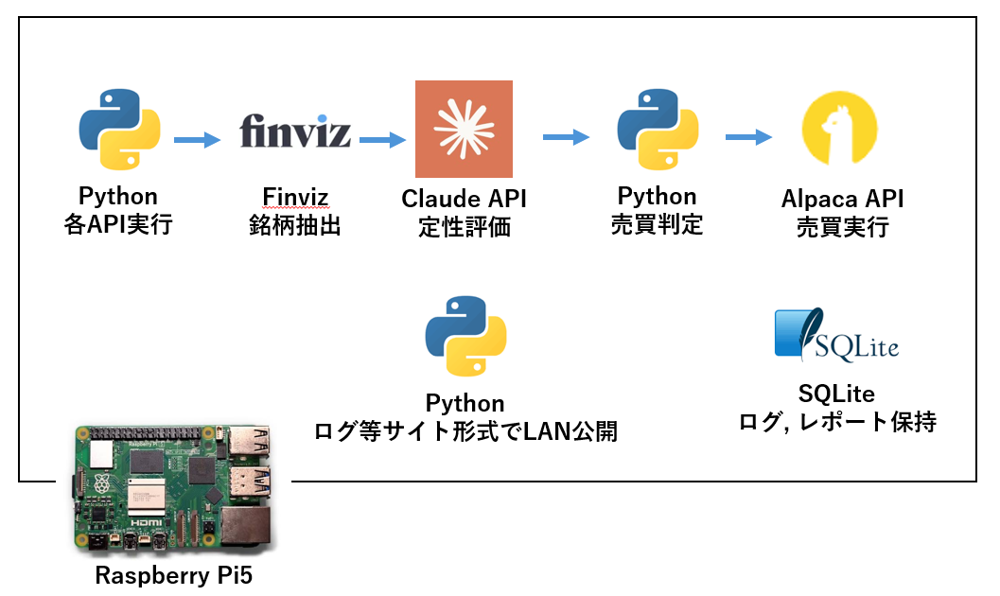
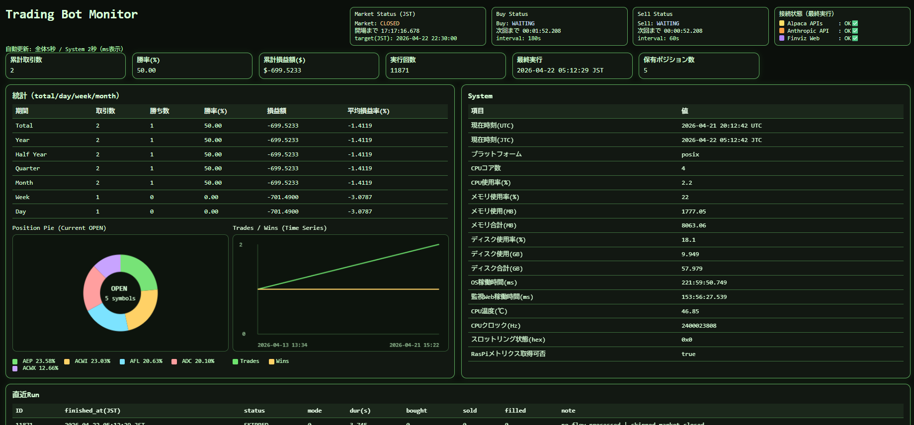
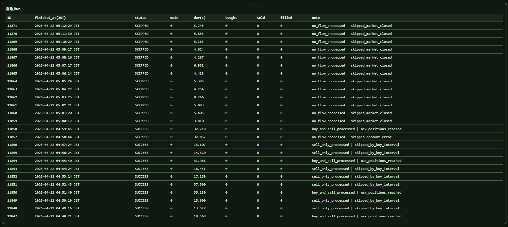
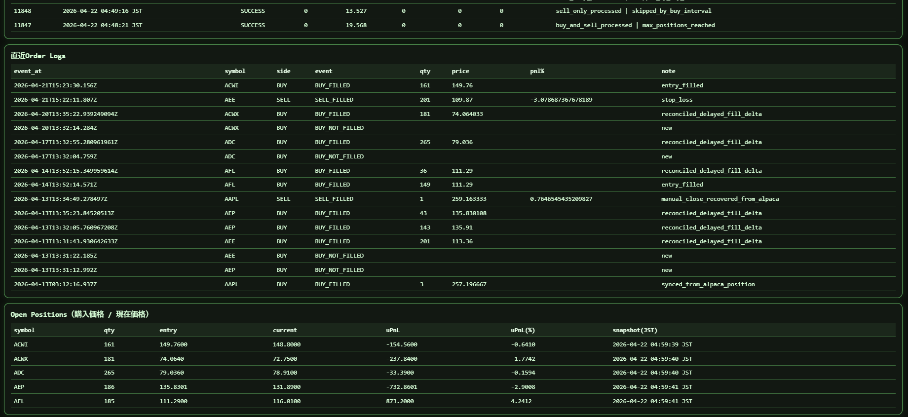

<!-- _class: lead -->

# Claude×アルゴトレード：株取引完全自動化の実装と運用
### RasPi5 / Finviz / Alpaca / Claude / Python による低コスト米株自動売買(paper)

---

# どうして作ろうと思った？

- 最近自動売買系のニュース記事が多くて興味あった(polymarket, gabagool22, claude...)
- 勝手にお金を増やしてくれたらうれしい
- 取引毎に一喜一憂したくない
- ラズベリーパイが余っていた(マイクラサーバーにはスペック不足)

<div class="img-row">
  
  
</div>

---

# 構成

<div class="img-stack">
  
</div>

---

# トレード/システム監視モニター

<div class="img-row">
  
  
</div>

<div class="img-stack">
  
</div>

---

# なぜ国内証券ではなく Alpaca か

- 個人向け traderAPI が扱いやすい 
- `paper`: 2,000ドルほどの仮想マネーを自由に使えるテスト環境
- `paper -> live` の移行が簡単
- Alpacaで仮想通貨もできるので展開しやすい(業務提携していた)

---

# 現状の概算期待値

- 勝率: `43% - 52%`
- 平均利益率: `+4.5% - +7.5%`
- 平均損失率: `-2.5% - -3.2%`
<br><br>
- 負けを小さく固定
- 勝ちトレードをトレーリングで伸ばす
- 実際の期待値はログ分析必要

---

# コスト感

- RasPiの電気代は、概算で **月100～200円程度** (VPSなら**600円**ほど)
- Claude API は通常運用で **1日あたり約 4.2 USD**
- ただし平日でも、保有ポジション数が上限に達していて新規買いを止めている日は **0.1 USD 程度** まで下がる
- 平日フル稼働が続く月は、Claude API がコストの大半を占める
- 1か月フル稼働想定だと **12,000円** 程度かかるので、それ以上の利益が必要

---

# ここから下のスライドはおまけ
👍

---

# 前提

- 実装環境: Windows で開発し、RasPi に移管
- 実運用: RasPi + `systemd timer/service`
- DB: SQLite
- 監視: 軽量Webモニタ
- AI: Claude 4.5 Sonnet

---

# システム全体像

```text
[データ取得]
  └ 株価 / ニュース / 出来高
        ↓
[銘柄選定AI]
  └ スクリーニング + スコアリング
        ↓
[売買判断エンジン]
  └ Pythonルール（SMA / RSI / ATR）
        ↓
[リスク管理]
  └ 損切り / 資金配分 / トレーリング
        ↓
[実行]
  └ Alpaca API
        ↓
[ログ・分析]
  └ SQLite / Claude / Monitor Web
```

---

# なぜ RasPi か

- 常時稼働させやすい
- 消費電力が低い
- `systemd` で定期実行できる
- SQLiteや軽量Web監視と相性が良い

可用性的な理想はVPSだが、プロトタイプとしては十分実用的

---

# 実際の運用構成

```text
RasPi
├ main.py            自動売買本体
├ monitor_web.py     監視Web
├ SQLite             取引履歴 / ログ / 統計
└ systemd            定期実行
```

- `Buy 180s`
- `Sell 60s`
- 市場時間外はガード

---

# モニタリング

- 取引履歴
- 勝率
- 総損益
- 稼働回数
- Open positions
- API接続状態
- RasPiの温度、CPUクロック、稼働時間

---

# Claude に何をさせているか

- ニュースやセンチメントを圧縮
- 非構造情報をJSON化
- 危険銘柄の除外補助
- 約定ログから改善点をまとめる

やっていないこと:

- 最終売買判断
- リスク管理の決定

---

# Claude のJSON出力イメージ

```json
{
  "ticker": "NVDA",
  "market_regime": "trend",
  "event_risk": "low",
  "sentiment": 0.52,
  "volatility_state": "normal",
  "avoid": false,
  "confidence": 0.81
}
```

---

# 使っている主要テクニカル

- RSI
- SMA50 / SMA200
- ATR
- breakout
- 出来高急増

役割:

- RSI: 過熱とモメンタム
- SMA: トレンド方向
- ATR: ボラ判定
- breakout: 上抜け確認

---

# このシステムの価値

- AIを使っているが、AI依存ではない
- 低コストで常時動く
- Paperで検証しながら改善できる
- ログが残るので、あとから分析できる
- 将来的に仮想通貨へ横展開しやすい

---

# 今後の改善

- 実トレード履歴から期待値を実測化
- 売り保護条件の最適化
- 仮想通貨向け戦略への展開
- VPS移行による安定化
- 監視Webの強化

---


# シグナル設計の進め方

- 売買シグナルの大枠は、Codex と ChatGPT との壁打ちで設計した
- 方向性を決めた後の具体的な設定値や閾値は、AIの提案をベースに調整している
- 体感としては、設定値のかなりの部分をAI提案に寄せている

---

# AIパートの役割

```text
① Finviz -> 銘柄抽出
② Claude -> 条件改善 / 定性評価
③ Python -> 売買ルール
④ Alpaca -> 自動実行
⑤ Claude -> ログ分析
```

- Claudeは **売買を決めない**
- Claudeは非構造情報をJSONへ圧縮する
- 最終執行判断はPythonが行う

---

# なぜこの設計か

- AIは便利だが、判断を丸投げすると再現性が弱い
- 自動売買では **一貫した出口** が重要
- そのため
- エントリー補助: AI
- 執行判断: Python
- ログ分析: AI

という分担にしている


---

# 買いフロー

```text
Finviz
↓
Pythonで一次フィルタ
↓
ClaudeでJSONスコアリング
↓
Pythonで最終買い判定
↓
Pythonで数量計算
↓
AlpacaでBUY注文
↓
SQLiteへ保存
↓
Claudeでログ分析
```

---

# 買いフローの実際の処理

- Finviz: 候補銘柄をスクレイピング
- Python: 日足データを取得して `価格 / 出来高 / SMA / RSI / ATR / breakout` を計算
- Claude: `market_regime / event_risk / sentiment / confidence / avoid` をJSON化
- Python: 最終スコアと閾値で買い判定
- Alpaca: 発注

---

# 買いシグナル

- 価格が `8 USD - 250 USD`
- 平均出来高が閾値以上
- `SMA50 > SMA200`
- RSIが適正範囲かつ上向き
- ATRが低すぎず高すぎない
- Claudeが `avoid=true` でない
- `event_risk=high` でない
- 最終スコアが一定以上

---

# 買いシグナルの要点

- 順張り寄り
- 低品質な候補はかなり落とす
- Paper環境では一部救済ロジックあり
- 実際の注文はさらに上の発注閾値を要求

つまり

**候補抽出は広く、実発注は狭く**

---

# 売りフロー

```text
Alpacaから保有ポジション取得
↓
Pythonで価格 / 日足 / 高値を取得
↓
Pythonで売り条件を計算
↓
SELL条件なら Alpacaへ売り注文
↓
SQLiteへ保存
↓
Claudeで約定ログ分析
```

---

# 売りシグナル

- `-3%` で損切り
- 前日終値比 `-6%` で急落退出
- `+6%` で半分利確
- 残りは高値追随トレーリング
- 急落気味ならトレーリングをタイト化
- 強トレンドなら少し緩めて利を伸ばす
- 半利確後の残り半分には利益フロアを設定

---

# 売りロジックの意図

- 負けは早く切る
- 勝ちは半分確定しつつ残りを伸ばす
- ただ回転を上げるのではなく、**利益最大化を優先**
- 既存の未約定SELL注文がある銘柄には重複売りを出さない

---

# リスク管理

- 損切り: `-3%`
- 半利確: `+6%`
- 通常トレーリング: 高値から `-3%`
- 急落時タイト化: `-1.5%`
- 日次損失上限: `-3%`
- 同時保有数: 上限あり
- 資金配分: スコア連動または均等配分

---


<!-- _class: lead -->

# まとめ

目標は **勝つより、負けない**
AIは補助、最終判断はPython
Alpaca + RasPi + SQLite で低コストに構築
現在は米株、将来的には仮想通貨にも拡張可能
